HW1

M11015053黃俊翰

介面 縮骨架

骨架speed參數 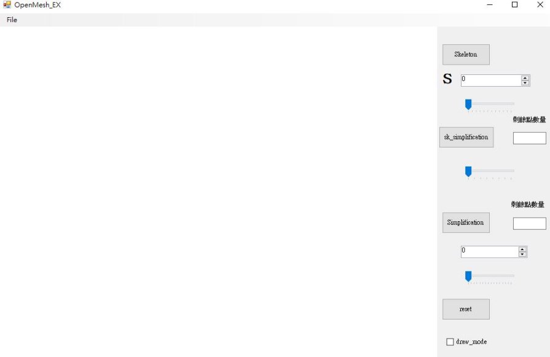 骨架slidebar

骨架後的減面 骨架後的減面當 前剩餘點數量

 骨架後的減面sliderbar 簡化 

簡化後剩餘點數量  簡化sliderbar

 重製參數  切換成畫線和點

- 原來點數量=50002

簡化

剩餘點數量=30002 剩餘點數量=10002 剩餘點數量=5002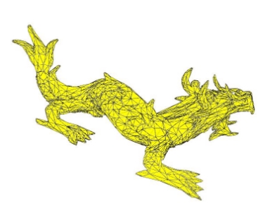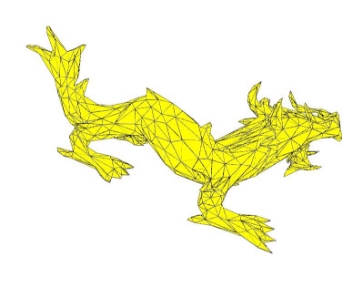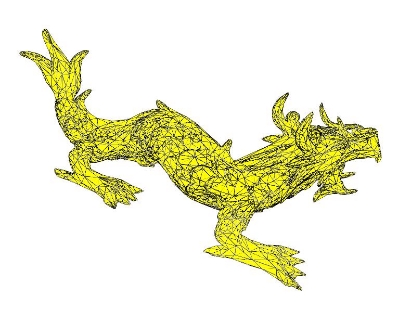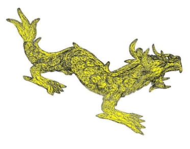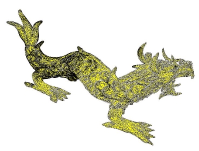

剩餘點數量=3002 剩餘點數量=1002 剩餘點數量=502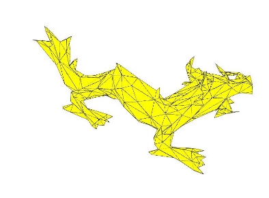

Demo 影片

https://github.com/j24576931000/simplification_and_skeleton/assets/31430607/d8f03255-a239-4123-ae15-ea1a7c33bd13

骨架 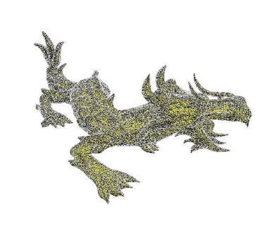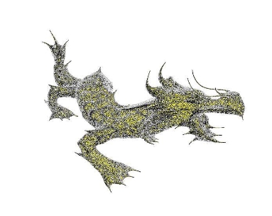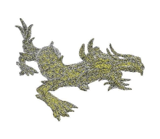

參數: 

W\_L0=1.0 

W\_H0= 

Speed=8 Iteration:0 Iteration:8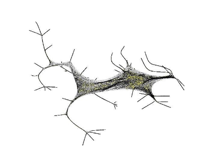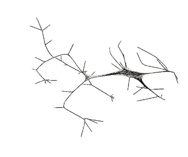

Iteration:7

Iteration:9

Iteration:10 iteration:11

Demo 影片

https://github.com/j24576931000/simplification_and_skeleton/assets/31430607/1fe70876-7574-4613-8c58-f65e77a8579c

Connectivity Surgery

目前是縮完骨架後,減面到一定程度在縮一次骨架

- 參數: wa = 1.0 and wb= 0.1

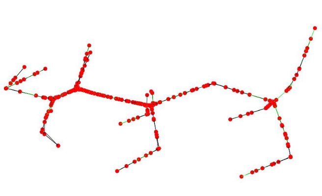 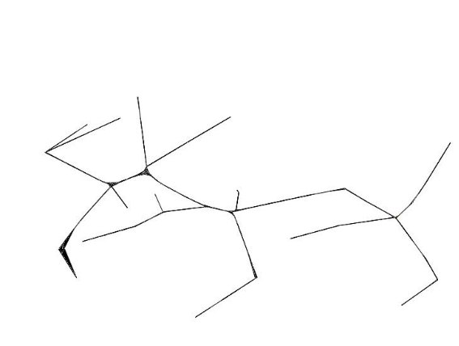

Demo 影片

https://github.com/j24576931000/simplification_and_skeleton/assets/31430607/185bf36a-b63e-495a-a3c5-f0b36442ebd1

